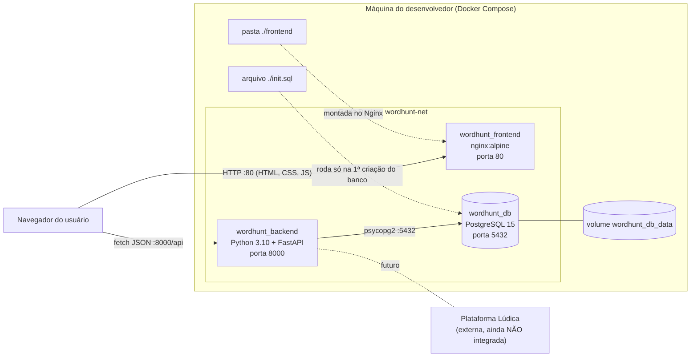
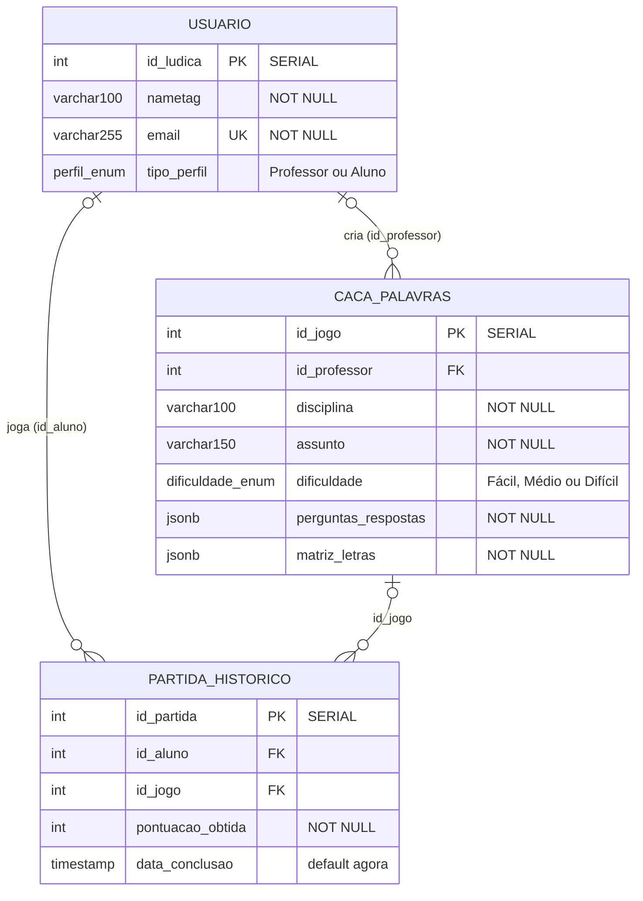
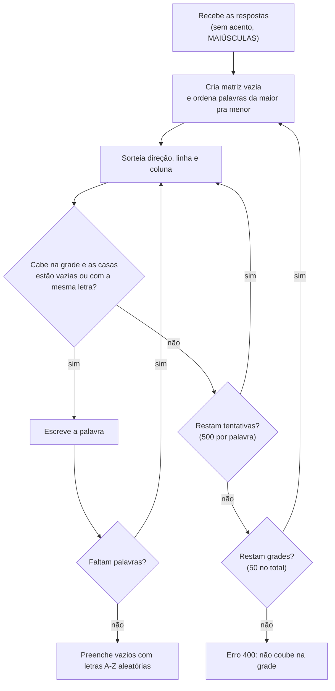
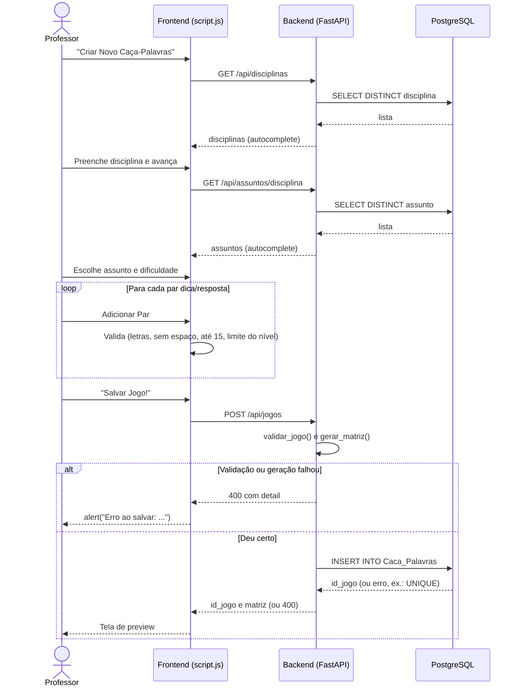

# WordHunt: Manual do Desenvolvedor e do Usuário

Projeto da disciplina **Projeto e Construção de Sistemas** (CEFET/RJ).
Equipe: Clara Ribeiro Barreto, Julia Iacovellis Pinho e Kaio da Silva dos Santos.

## Status do projeto

O WordHunt está **em desenvolvimento**. Hoje funciona de ponta a ponta o **lado do professor** (criar, editar, excluir e visualizar caça-palavras). O **lado do aluno** (escolher jogo, jogar, pontuar, histórico) e a **integração com a Lúdica** estão previstos nos documentos, mas ainda não existem no código. Os manuais separam o que já funciona do que é planejado.

---

# Parte 1: Manual do Desenvolvedor

## 1. Visão geral

Jogo educativo de caça-palavras. O professor cadastra pares de **dica + resposta (uma palavra)** e o sistema monta a grade de letras sozinho. Aplicação web cliente-servidor, rodando em Docker com três containers:

| Container | Tecnologia | Função |
|---|---|---|
| `wordhunt_frontend` | HTML, CSS e JavaScript puro, servidos pelo Nginx (`nginx:alpine`) | Interface (hoje só a do professor) |
| `wordhunt_backend` | Python 3.10 + FastAPI (Uvicorn) | API REST, regras de negócio e geração da grade |
| `wordhunt_db` | PostgreSQL 15 | Persistência |

Não há framework de frontend nem etapa de build: o Nginx só entrega a pasta `frontend/`.

## 2. Arquitetura (diagrama de implantação)

O navegador pega a página no Nginx (porta 80) e faz as chamadas da API **direto** no backend (porta 8000). O Nginx não faz proxy. O endereço da API está fixo no `script.js` (`http://localhost:8000/api`).



## 3. Estrutura de pastas

```
CacaPalavras-dev/
├── docker-compose.yml
├── init.sql
├── README.md
├── backend/
│   ├── main.py
│   ├── requirements.txt
│   └── Dockerfile
└── frontend/
    ├── index.html
    ├── script.js
    └── style.css
```

O Dockerfile do backend parte de `python:3.10-slim`, instala o `requirements.txt`, copia o `main.py` e sobe o Uvicorn na porta 8000.

## 4. Instalação e execução

**Pré-requisitos:** Docker Desktop (Windows/Mac) ou Docker Engine com Compose (Linux), aberto e com "Engine running". E Git. Não precisa instalar Python nem Postgres.

```bash
git clone <https://github.com/marceloareas/CacaPalavras.git>
cd CacaPalavras-dev
docker compose up --build
```

Quando os logs mostrarem `database system is ready to accept connections` e `Uvicorn running on http://0.0.0.0:8000`:

| Endereço | O que é |
|---|---|
| http://localhost | O jogo |
| http://localhost:8000/docs | Documentação da API (Swagger) |

Para parar: `Ctrl+C` ou `docker compose down` (os jogos continuam salvos no volume). Para subir de novo: `docker compose up`.

| Situação | O que fazer |
|---|---|
| Mudou só `frontend/` | Recarregar a página (`Ctrl+F5`) |
| Mudou `main.py` ou `requirements.txt` | `docker compose up --build` |
| Mudou `init.sql` ou `docker-compose.yml`, ou quer o banco limpo | `docker compose down -v` e depois `docker compose up --build` |

> Obs: O `-v` apaga o volume: **todos os jogos salvos localmente somem**. Isso é necessário porque o `init.sql` só roda quando o banco é criado do zero. Depois de um `git pull`, o README recomenda sempre fazer `down -v` + `up --build`.

Para entrar no banco: `docker exec -it wordhunt_db psql -U admin -d wordhunt` (a porta 5432 também está aberta no host).

## 5. Configurações

Tudo no `docker-compose.yml`: banco `wordhunt`, usuário `admin`, senha `adminpassword`, `DATABASE_URL=postgresql://admin:adminpassword@db:5432/wordhunt`, rede `wordhunt-net`, volume `wordhunt_db_data`. Sem a variável, o `main.py` usa `localhost:5432` como padrão. São credenciais de **desenvolvimento**.

## 6. Banco de dados



- `Caca_Palavras` tem **UNIQUE em (disciplina, assunto, dificuldade)**.
- As FKs não têm `ON DELETE CASCADE`, por isso o endpoint de excluir jogo apaga o histórico antes.
- **Não existem tabelas de Disciplina nem de Assunto**: são colunas de texto, e as sugestões vêm de `SELECT DISTINCT`. Uma disciplina só "existe" depois que um jogo dela é salvo.
- `Partida_Historico` existe, mas nenhum endpoint usa ela ainda (só o de excluir jogo limpa os registros).
- `id_ludica` é um `SERIAL` (gerado pelo banco). O `init.sql` cadastra dois usuários de teste: *Prof. João* (Professor) e *Aluno Maria* (Aluno).

**Formato dos JSONB.** `perguntas_respostas` é uma lista como `[{"pergunta": "Onde tomamos café?", "resposta": "Xícara"}]` (guardada como o professor digitou, com acento). `matriz_letras` é uma lista de listas de letras maiúsculas sem acento (15 linhas por 17, 21 ou 25 colunas).

> Obs:  **O banco não guarda a posição das palavras**, só as letras. Para destacar as respostas, o frontend procura as palavras na matriz de novo (`localizarPalavra` no `script.js`). Se as letras aleatórias formarem a mesma palavra em outro lugar, as duas ocorrências ficam pintadas.

## 7. Backend (`backend/main.py`)

FastAPI com CORS liberado. Cada requisição abre e fecha uma conexão com o Postgres via `psycopg2`, sem ORM (o `sqlalchemy` está no `requirements.txt`, mas o `main.py` não usa).

| Método | Rota | O que faz |
|---|---|---|
| GET | `/api/usuarios` | Lista usuários (login simulado) |
| GET | `/api/disciplinas` | Disciplinas distintas de todos os professores |
| GET | `/api/assuntos/{disciplina}` | Assuntos distintos daquela disciplina |
| GET | `/api/jogos/professor/{id_professor}` | Jogos de um professor |
| GET | `/api/jogos/{id_jogo}` | Jogo completo (404 se não existir) |
| POST | `/api/jogos` | Valida, gera a grade e salva. Devolve `{id_jogo, matriz}` |
| PUT | `/api/jogos/{id_jogo}` | Valida, **gera grade nova** e salva (não altera o `id_professor`) |
| DELETE | `/api/jogos/{id_jogo}` | Apaga o histórico e depois o jogo |

Configuração por dificuldade (`CONFIG` no `main.py`): mínimo de 10 palavras e resposta de até 15 letras em todos os níveis.

| Dificuldade | Grade (linhas x colunas) | Máx. palavras | Direções |
|---|---|---|---|
| Fácil | 15 x 17 | 15 | direita e baixo |
| Médio | 15 x 21 | 20 | 8 direções |
| Difícil | 15 x 25 | 25 | 8 direções |

**Validações (erro 400):** dificuldade inexistente; quantidade de pares fora de 10 até o máximo do nível; par sem pergunta ou com resposta que não seja só letras (acentos aceitos); resposta com mais de 15 letras; palavras que não couberam na grade; erro genérico do banco ao salvar. A resposta é guardada com acento, mas entra na grade sem acento e em maiúsculas.

**Geração da grade:** as palavras são ordenadas da maior para a menor e posicionadas por sorteio de direção/linha/coluna (até 500 tentativas por palavra, até 50 grades). Podem se cruzar se a letra do cruzamento for igual. O resto é preenchido com letras aleatórias. Como é tudo sorteado, salvar de novo o mesmo jogo gera uma grade diferente.



## 8. Frontend (`frontend/`)

- `index.html`: todas as telas num arquivo só; cada uma é uma `div.screen`, e só a que tem `active` aparece. Telas: login, menu do professor, meus jogos, passos 1 a 4 da criação e preview.
- `script.js`: toda a lógica (troca de telas, chamadas à API, validações, desenho da grade em CSS Grid).
- `style.css`: visual (tons de bege, bordas pretas, sombra "dura" nos botões).

O `login()` guarda o id do usuário escolhido; se a opção contém "Professor", abre o menu, senão mostra um alerta de "em desenvolvimento".

**Regras duplicadas** entre frontend e backend (se mexer em uma, mexa na outra):

| Regra | Backend (`main.py`) | Frontend (`script.js`) |
|---|---|---|
| Máx. de palavras por nível | `CONFIG[...]["max_palavras"]` | `LIMITES` |
| Máx. de letras por resposta | `MAX_LETRAS` | `MAX_LETRAS` |
| Mínimo de palavras (10) | `MIN_PALAVRAS` | número fixo em `salvarJogo()` e no `index.html` |
| Direções das palavras | `_tentar_gerar` | `localizarPalavra` |

## 9. Fluxo: professor cria um caça-palavras



**Casos de uso:** o grupo já tem o diagrama no Astah (`Diagrama_de_Casos_de_Uso_-_WordHunt.pdf`); vale exportar como imagem e colocar aqui. Resumo: o **Aluno** seleciona jogo (extensões: modo aleatório, filtrar por dificuldade, filtrar por tema), visualiza perfil e histórico, joga e se autentica; o **Professor** mantém caça-palavras, se autentica e joga; a **Lúdica** (externa) se liga à autenticação.

## 10. Deploy

O único modo de execução presente nos arquivos é o **Docker Compose** da seção 4. Em outra máquina, basta clonar e rodar os mesmos comandos, com as portas **80**, **8000** e **5432** livres.

Se for subir em outro lugar: o `API_URL` está fixo em `localhost`, as credenciais do banco estão no `docker-compose.yml`, o CORS está liberado para qualquer origem e a porta do Postgres está aberta.

## 11. Limitações e o que falta

**Ainda não implementado:** área do aluno (o login mostra "Área do aluno ainda em desenvolvimento!"); jogar o caça-palavras (inclusive o professor testar); pontuação e gravação em `Partida_Historico`; perfil e histórico; filtros e modo aleatório; integração com a Lúdica (hoje o login é a lista de usuários do `init.sql`).

**Diferenças entre protótipo e sistema:** no protótipo, "Criar nova matéria" tem nome e **descrição** e há uma tela própria para assunto; no sistema, disciplina e assunto são digitados num campo com autocomplete e **não há descrição** nem tabela própria. Os botões do menu do professor também são diferentes ("Jogar!/Criar!" no protótipo; "Visualizar Meus Caça-Palavras/Criar Novo" no sistema).

**Divergências nos documentos:**
- **RN09** diz máximo de 25 palavras; o sistema limita por dificuldade (15, 20 ou 25).
- **RN05** fala em filtrar por professor, disciplina e assunto; o diagrama de casos de uso mostra filtrar por dificuldade e por tema.
- **UC-02** está na lista de casos de uso mas não aparece no diagrama desenhado.
- A **pontuação** (valor de acerto e erro) não está definida. O protótipo mostra "Score: 5" e "Score: -5" só como exemplo.

**A melhorar:** a API não tem autenticação (qualquer requisição altera ou exclui qualquer jogo); a **RN07** é checada só no frontend (ignorando maiúsculas/minúsculas), e o banco só impede repetir a trinca exata disciplina + assunto + dificuldade; a mensagem de erro de banco ao salvar é genérica e fala só em "assunto já existe".

---

# Parte 2: Manual do Usuário

## 1. O que é

O WordHunt é um caça-palavras educativo. O professor monta o jogo com **dicas** e **respostas** (uma palavra cada) e o sistema espalha as respostas numa grade. A proposta é o aluno achar as palavras e ligar cada uma à pergunta certa.

| Perfil | O que pode fazer |
|---|---|
| **Professor** | Criar, editar, excluir e visualizar caça-palavras; definir disciplina, assunto e dificuldade; (previsto) jogar pra testar |
| **Aluno** | (previsto) Filtrar e selecionar jogos, usar o modo aleatório, jogar, pontuar e consultar perfil e histórico |

> Obs: **Hoje só o fluxo do professor está disponível.** Se entrar como aluno, o sistema avisa que a área está em desenvolvimento. As partidas do professor serão só de teste: não contam pontos de aluno nem vão para a Lúdica.

## 2. Como acessar

Abra **http://localhost** (com o sistema rodando), escolha um usuário na lista e clique em **Entrar no Sistema**. O login é **simulado**: aparecem usuários de teste ("Prof. João" e "Aluno Maria"). A integração com a Lúdica virá depois.

## 3. Guia do Professor

O **Painel do Professor** tem: **Visualizar Meus Caça-Palavras**, **Criar Novo Caça-Palavras** e **Sair da Conta**.

### Criar um caça-palavras (4 passos, com barra de progresso)

1. **Disciplina:** digite ou escolha uma sugestão. Se digitar uma que já existe mudando só maiúsculas/minúsculas, o sistema usa a já cadastrada, pra não duplicar.
2. **Assunto:** mesma ideia, com sugestões dos assuntos daquela disciplina.
3. **Dificuldade:** Fácil, Médio ou Difícil (tabela abaixo).
4. **Palavras e dicas:** escreva a dica, escreva a resposta e clique em **Adicionar Par (OK)**. O contador mostra quantos pares você já tem. Use **✎** para editar um par (depois **Salvar Alteração** ou **Cancelar edição**) e **X** para remover. Com pelo menos 10 pares, clique em **Salvar Jogo!**.

**Regras da resposta:** uma palavra só, sem espaços; só letras (sem números ou símbolos); acentos aceitos (na grade aparecem sem acento, ex.: "Xícara" vira XICARA); no máximo 15 letras.

| Dificuldade | Grade (linhas x colunas) | Máx. palavras | Direções |
|---|---|---|---|
| Fácil | 15 x 17 | 15 | Direita e para baixo |
| Médio | 15 x 21 | 20 | 8 direções (diagonais e de trás pra frente) |
| Difícil | 15 x 25 | 25 | 8 direções |

O mínimo é **10 palavras** em todos os níveis. Você não escolhe onde cada palavra fica, a grade é automática.
